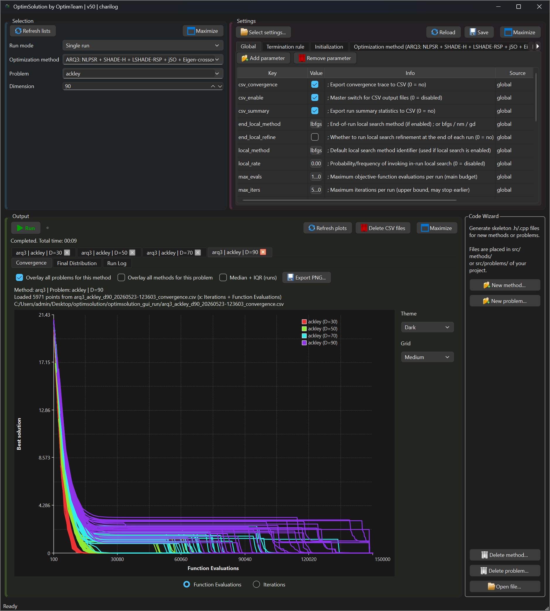
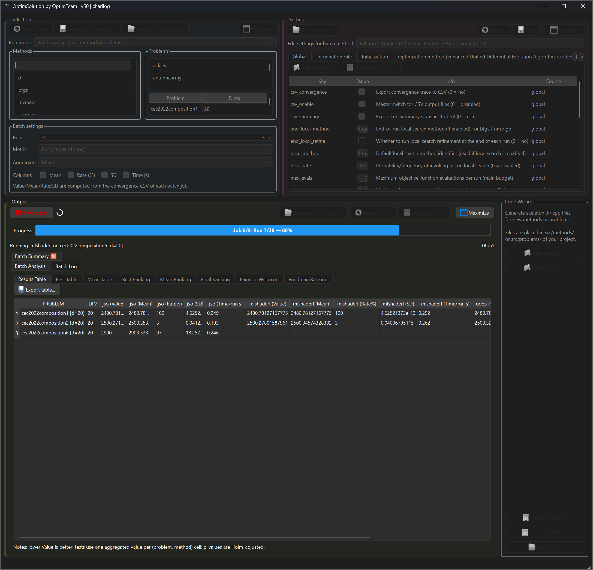
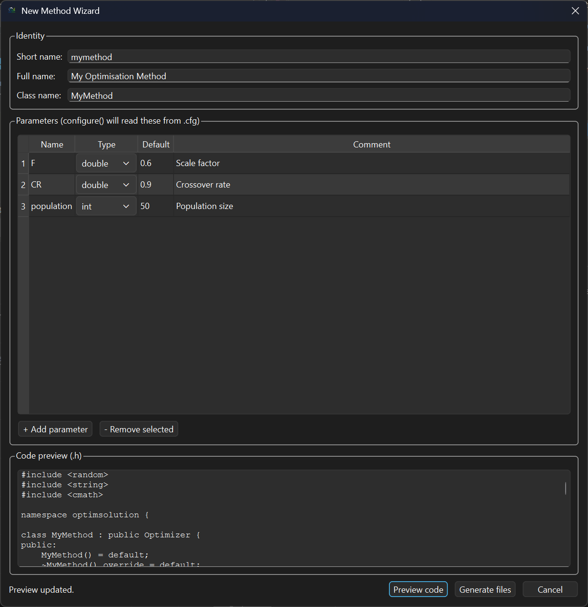

<p align="center">
  
</p>

Optimsolution (version 52) is a C++ optimization framework that combines a full-featured Qt-based GUI with a CLI for experimenting with population-based metaheuristics and numerical optimizers across benchmark and real-world problems. The GUI drives the complete workflow selecting methods and problems, configuring runs, launching batch experiments, visualizing convergence, and analyzing results through ranking tables and statistical tests while the CLI provides the same capabilities for scripted and headless execution. Both interfaces share the same optimization core and configuration file, and both support explicit computational budgets, multiple initialization strategies, local search integration, and sensitivity analysis of method and problem parameters.

> English manual: [optimsolution_manual_EN.pdf](./docs/optimsolutionManual_EN.pdf)
>
> Greek manual: [optimsolution_manual_GR.pdf](./docs/optimsolutionManual_GR.pdf)

---

## 1) What changed from v51 to v52

### OpenMP parallelization across every run mode
Independent runs can now execute in parallel via OpenMP instead of strictly one-at-a-time. This applies uniformly to **all four run modes** — Single run, Batch run, and both Sensitivity analysis modes (method parameters and problem parameters) — since all of them are ultimately built on the same "N independent runs" execution path.

Two new `[global]` settings control this:

```ini
[global]
parallel_runs = 0   ; 0 = serial (default), 1 = parallel independent runs
omp_threads   = 0   ; 0 = use all available cores, N = cap at N threads
```

Parallel execution is designed to be **numerically identical** to serial execution: every run keeps its own `Problem` instance and its own RNG seeded with `seed_base + run_index`, exactly as in the serial path, so turning `parallel_runs` on or off never changes the reported statistics — only the wall-clock time. Problems with non-thread-safe global state (the GKLS generator family) are automatically kept serial regardless of this setting, with a note printed to the console.

### Correctness fixes across several problems
A systematic review of the problem library turned up and corrected a number of issues, including (non-exhaustive):
- Analytic gradient errors (a mis-scaled term in `levy`, a missing contribution in `stepellipsoidal`, and a `weierstrass` gradient replaced with a closed-form derivative after its finite-difference version proved numerically unusable at the default parameters).
- A malformed objective function in `test30n` (an incorrect term combination that silently dropped part of the intended landscape).
- An incorrect cutoff-function formula and mismatched reference parameters in `tersoffb`/`tersoffc`, plus a corrected default dimension (now D=30, matching the literature).
- Several stale or duplicated entries in the fixed-dimension problem registry (affecting `hydrothermal`, `messenger`, `polyphase`, `shubert`, among others), which had been causing the GUI to report or enforce the wrong dimension for those problems.
- A GUI/state bug where the Batch run **Results table** could go blank after a batch finished when exactly one problem was selected (the underlying result data was always safe on disk — this was purely a display/reconstruction issue).

### Code Wizard improvements
The **Code Wizard** panel supports creating and deleting methods and problems directly from the GUI. When a new method or problem is generated or deleted, the application writes a pending-rebuild flag (`.rebuild_pending`) and prompts for a restart. On the next startup, if the flag is detected, the GUI offers to rebuild automatically before loading the factory — eliminating the LNK1104 locked-executable error that would otherwise occur on Windows.

---

## 2) Available methods and problems (CLI)

CLI syntax:

```bash
optimsolution <method> <problem>
```
or

```bash
optimsolution <method> <problem> <dimension>
```

### Methods (69)

#### Differential evolution and variants

| Short name | Full name |
|---|---|
| `arq` | ARQ: Adaptive RTR with Quarantine |
| `arq2` | ARQ2: ARQ/IDE roulette with Quarantine + ARQ-only micro-restart + jSO-style K |
| `arq3` | ARQ3: Extended ARQ variant |
| `awjso` | Adaptive-Weight jSO |
| `bjso` | Band-guided jSO |
| `bwjso` | Best-Worst corrected jSO |
| `de` | Differential Evolution |
| `ea4eig` | Evolutionary Algorithms with Eigen crossover |
| `jde` | Self-adaptive Differential Evolution |
| `jso` | Hybrid Differential Evolution JSO |
| `mjso` | Modified jSO |
| `mlshaderl` | Multi-operator L-SHADE with Reinforcement Learning |
| `nlshadelbc` | NL-SHADE-LBC |
| `pde` | Parallel Differential Evolution |
| `sade` | Self-adaptive Differential Evolution (SaDE) |
| `sfcde` | Success-Failure Competitive Differential Evolution |
| `sparq` | SPARQ Optimizer |
| `tridentde` | TRIDENT Differential Evolution |
| `ude` | Unified Differential Evolution |
| `ude3` | Enhanced Unified Differential Evolution Algorithm 3 |
| `ujso` | Updated jSO |

#### Population-based, swarm, evolutionary, and hybrid optimizers

| Short name | Full name |
|---|---|
| `abc` | Artificial Bee Colony |
| `aco` | Ant Colony Optimization |
| `acor` | Ant Colony Optimization for Continuous Domains |
| `alo` | Ant Lion Optimizer |
| `ba` | Bat Algorithm |
| `bho` | BioHealing Optimization |
| `clpso` | Comprehensive Learning Particle Swarm Optimization |
| `cmaes` | Covariance Matrix Adaptation Evolution Strategy |
| `cs` | Cuckoo Search |
| `egco` | Eel and Grouper Optimizer |
| `eo` | Equilibrium Optimizer |
| `fa` | Firefly Algorithm |
| `ga` | Genetic Algorithm |
| `gahs` | Genetic Algorithm with Harmony Search |
| `gao` | Giant Armadillo Optimizer |
| `gsa` | Gravitational Search Algorithm |
| `gwo` | Grey Wolf Optimizer |
| `hades` | HADES Optimizer |
| `hba` | Honey Badger Algorithm |
| `hho` | Harris Hawks Optimization |
| `hs` | Harmony Search |
| `jaya` | JAYA |
| `kh` | Krill Herd |
| `lmcmaes` | Limited-Memory CMA-ES |
| `lracmaes` | Low-Rank Adaptation CMA-ES |
| `mewoa` | Modified Enhanced Whale Optimization Algorithm |
| `mfo` | Moth-Flame Optimization |
| `mpa` | Marine Predators Algorithm |
| `mscso` | Modified Sand Cat Swarm Optimization (multi-strategy fusion) |
| `mvo` | Multi-Verse Optimizer |
| `pga` | Parallel Genetic Algorithm |
| `ppso` | Parallel Particle Swarm Optimization |
| `psao` | Parallel Smell Agent Optimization |
| `psioa` | Parallel Sporulation-Inspired Optimization Algorithm |
| `pso` | Particle Swarm Optimization |
| `sa` | Simulated Annealing |
| `sao` | Smell Agent Optimization |
| `sca` | Sine Cosine Algorithm |
| `sioa` | Sporulation-Inspired Optimization Algorithm |
| `sma` | Slime Mould Algorithm |
| `so` | Snake Optimizer |
| `tlbo` | Teaching-Learning-Based Optimization |
| `wca` | Water Cycle Algorithm |
| `woa` | Whale Optimization Algorithm |

#### Local search methods

| Short name | Full name |
|---|---|
| `bfgs` | Broyden-Fletcher-Goldfarb-Shanno |
| `gd` | Gradient Descent |
| `lbfgs` | Limited-memory Broyden-Fletcher-Goldfarb-Shanno |
| `nm` | Nelder-Mead Simplex |

### Problems (124)

#### Classical and synthetic benchmarks

`ackley`, `alpine1`, `attractivesector`, `beale`, `bohachevsky1`, `bohachevsky2`, `bohachevsky3`,
`booth`, `branin`, `bucherastrigin`, `bukinn6`, `camel`, `cigar`, `colville`, `cosinemixture`,
`crossintray`, `differentpowers`, `diracproblem`, `dixonprice`, `dropwave`, `easom`, `eggholder`,
`ellipsoidal`, `equalmaxima`, `expotential`, `gallagher101`, `gallagher21`, `goldstein`, `griewank`,
`griewankrosenbrock`, `hansen`, `hartmann3`, `hartmann6`, `holdertable`, `katsuura`, `langermann`,
`levy`, `lunacekbirastrigin`, `matyas`, `mccormick`, `michalewicz`, `perm`, `potential`, `powell`,
`rastrigin`, `rastrigin2`, `rosenbrock`, `rotatedrosenbrock`, `salomon`, `schaffer`, `schwefel`,
`shekel5`, `shekel7`, `shekel10`, `shubert`, `sinusoidal`, `sphere`, `stepellipsoidal`, `test2n`,
`test30n`, `trid`, `weierstrass`, `whitley`, `zakharov`

#### Niching / multimodal specialized benchmarks

`vincent`, `fiveunevenpeaktrap`
*(see also `equalmaxima`, `gallagher101`, `gallagher21`, `shubert` above — all originate from the same CEC-style niching/multimodal literature)*

#### Real-world and application-driven problems

`antennaarray`, `antennaula`, `bifunctionalcatalyst`, `cassini`, `cassini1`, `datacentercooling`,
`ded1`, `ded2`, `eld1`, `eld2`, `eld3`, `eld4`, `eld5`, `fmsynth`, `gascycle`, `gtoc1`,
`heatexchanger`, `himmelblau`, `hydrothermal`, `ik6dof`, `messenger`, `ofdmpower`, `polyphase`,
`portfoliomv`, `rosetta`, `sagas`, `smartportenergy`, `stirredtankreactor`, `tandem`, `tersoffb`,
`tersoffc`, `tnep`, `transmissionpricing`, `vibratingplatform`, `weatherirrigation`,
`wirelesscoverage`

#### Mechanical engineering design benchmarks

`weldedbeam`, `speedreducer`, `pressurevessel`, `springdesign`, `cantileverbeam`, `threebartruss`,
`geartrain`

#### GKLS test classes

`gkls250`, `gkls350`, `gkls2100`

#### CEC 2022 representative functions

`cec2022_zakharov`, `cec2022_rosenbrock`, `cec2022_schafferf7`,
`cec2022_noncontinuous_rastrigin`, `cec2022_levy`, `cec2022_hybrid2`, `cec2022_hybrid6`,
`cec2022_hybrid10`, `cec2022_composition1`, `cec2022_composition2`, `cec2022_composition6`,
`cec2022_composition7`

---

## 3) Windows (Console + GUI)

> **Windows installer available:** Download and run **Optimsolution.exe** from:
>
> **[Optimsolution.exe (Windows Installer)](https://www.dit.uoi.gr/files/optimsolution.zip)**

### Prerequisites
- Visual Studio 2022 (Community or Build Tools)
  - Workload: **Desktop development with C++**
  - Components: **MSVC v143**, **Windows 10/11 SDK**
- CMake available in **PATH**
- **Qt 6.x (MSVC 2022 x64)** for the GUI target, e.g. `C:\Qt\6.10.1\msvc2022_64`

Recommended shell: **x64 Native Tools Command Prompt for VS 2022** or **Developer PowerShell for VS 2022**.

### Build and run (GUI + CLI) — Release

Delete any existing build directory.

```powershell
Remove-Item -Recurse -Force .\build -ErrorAction SilentlyContinue
```

Configure with the GUI target enabled.

```powershell
cmake -S . -B build -G "Visual Studio 17 2022" -A x64 `
  "-DCMAKE_PROJECT_INCLUDE:FILEPATH=$PWD/cmake/optimsolution_gui.cmake" `
  "-DCMAKE_PREFIX_PATH=C:\Qt\6.10.1\msvc2022_64"
```

Build both targets.

```powershell
cmake --build build --config Release --target optimsolution_gui
cmake --build build --config Release --target optimsolution
```

Deploy Qt runtime next to the GUI executable.

```powershell
& "C:\Qt\6.10.1\msvc2022_64\bin\windeployqt.exe" `
  --no-translations --compiler-runtime `
  ".\build\Release\optimsolution_gui.exe"
```

Run.

```powershell
.\build\Release\optimsolution_gui.exe
.\build\Release\optimsolution.exe arq tersoffc
```

---

## 4) Linux (Console + GUI)

### Prerequisites
- GCC or Clang, CMake, Ninja (recommended)
- Qt 6.x development packages

### Build and run — Release

```bash
sudo apt update && sudo apt upgrade
sudo apt install qt6-base-dev qt6-base-dev-tools qt6-tools-dev qt6-tools-dev-tools
rm -rf build
cmake -S . -B build -G Ninja \
  -DCMAKE_BUILD_TYPE=Release \
  -DCMAKE_PROJECT_INCLUDE=cmake/optimsolution_gui.cmake
cmake --build build --target optimsolution_gui
cmake --build build --target optimsolution
./build/optimsolution_gui
./build/optimsolution arq tersoffc
```

---

## 5) Settings (`optimsolution.cfg`)

Both the CLI and GUI read experiment defaults from `optimsolution.cfg`. The GUI can apply additional runtime-only overrides (e.g. forcing CSV convergence output for plots) without modifying the file.

### Key sections

```ini
[global]
population       = 200
max_iters        = 500000
max_evals        = 150000
seed_base        = 4242
runs             = 30
success_tol      = 1e-8
local_rate       = 0.00
local_method     = lbfgs
end_local_refine = 0
end_local_method = lbfgs   ; bfgs / nm / gd
summary_enable   = 1
parallel_runs    = 0       ; 0 = serial, 1 = OpenMP-parallel independent runs (same results, either way)
omp_threads      = 0       ; 0 = auto (all cores), N = cap at N threads

[stop]
rule = maxevals            ; bss|wss|tss|boss|srs|irs|doublebox|maxevals|all|none
eps  = 1e-10

[init]
type = uniform             ; uniform|normal|cauchy|laplace|lognormal|exponential|beta|levy|lhs|halton|oppositional
```

A method section overrides any global key for that optimizer only.

```ini
[arq]
population   = 100
pbest_frac   = 0.12
F            = 0.1
CR           = 0.9
archive_rate = 1.5
batch_frac   = 0.5
local_rate   = 0.00
local_method = lbfgs
```

---

## 6) GUI overview

The GUI and CLI share the same optimization core. The GUI adds four run modes, convergence plotting, batch analysis, sensitivity studies, and a code wizard for extending the framework without leaving the application.





### Run modes

| Mode | Description |
|---|---|
| **Single run** | One run of the selected method on the selected problem. Produces a convergence plot and run summary. |
| **Batch run** | All selected methods × all selected problems for N runs. Results appear in eight analysis views: Results Table, Best Table, Mean Table, Best Ranking, Mean Ranking, Final Ranking, Pairwise Wilcoxon, Friedman Ranking. |
| **Sensitivity analysis of method parameters** | Sweeps method parameters over a defined range (problem fixed). Shows how each parameter value affects the result. |
| **Sensitivity analysis of problem parameters** | Sweeps problem parameters such as dimension or bounds (method fixed). Characterizes problem difficulty as a function of its own configuration. |

All four modes can now run their independent repetitions in parallel via OpenMP (see [§5](#5-settings-optimsolutioncfg)), with results that are numerically identical to a fully serial run.

### Why the GUI is significantly faster than running the CLI directly

Although both the GUI and CLI share the same optimization core, the GUI delivers substantially higher throughput for multi-run and batch experiments. The performance gap comes from several architectural decisions in the GUI:

**Zero inter-run overhead.** The GUI manages a job queue (`batchQueue_`) and launches each CLI process immediately after the previous one completes — with no manual setup, no re-reading of configuration files between jobs, and no human latency between runs. In a batch of *M* methods × *P* problems × *N* runs, all *M × P* jobs are dispatched sequentially and automatically without any user interaction.

**Runtime configuration snapshots.** Instead of writing and re-reading `optimsolution.cfg` on disk for every run, the GUI builds an in-memory configuration snapshot (`optimsolution_gui_merged.cfg`) and passes it to the CLI via `--config`. GUI edits (population size, budget, method parameters) act as runtime overrides and are applied instantly without touching the on-disk file. This eliminates repeated file-system I/O for configuration between jobs.

**Off-thread CSV post-processing.** After each run completes, CSV parsing, table population, and statistical aggregation (rankings, Wilcoxon, Friedman) are performed off the GUI thread via `QtConcurrent::run`. The GUI thread never blocks waiting for post-processing: it immediately starts the next job in the queue while the analysis runs in the background.

**Dedicated log-writer thread.** Batch run logging uses a dedicated `batchLogWriter_` thread so that writing progress to the UI log panel does not compete with the optimizer process for CPU or I/O time.

**High-frequency live monitoring.** UI progress updates are driven by timers: 250 ms for batch log flushing, 200 ms for single-run log flushing, and 150 ms for sensitivity CSV polling. This tight polling interval means convergence data and progress bars are updated in near real-time without any manual file inspection by the user.

**Automatic configuration consistency.** The GUI guarantees that every job in a batch uses exactly the same configuration snapshot. When running the CLI manually, configuration drift between runs (accidental edits to `.cfg`, different working directories, forgotten flags) is a common source of irreproducible results. The GUI eliminates this class of error entirely.

The practical effect is that a batch experiment that would take several hours of manual CLI orchestration — launching processes, checking outputs, updating configuration, re-running failed jobs — can be completed in the same wall-clock time as the computations themselves, with no idle time between jobs. With OpenMP parallel runs enabled on top of this, the computations themselves can now also make use of all available CPU cores.

### Code Wizard
The Code Wizard panel (bottom-right) generates skeleton `.h` and `.cpp` files for new methods or problems, patches `factory.cpp` and `CMakeLists.txt` automatically, and triggers a rebuild on the next startup.

For full details see the English manual: [optimsolution_manual_EN.pdf](./docs/optimsolutionManual_EN.pdf)

---

## 7) Example run console output

The following screenshot shows the last iterations of **Run 30** and the final summary for:

- **Method:** `arq` · **Problem:** `tersoffc (Dim=24)` · **Runs:** 30 · **Budget:** 150 000 evals/run
- CLI syntax:
```bash
optimsolution arq tersoffc
```


