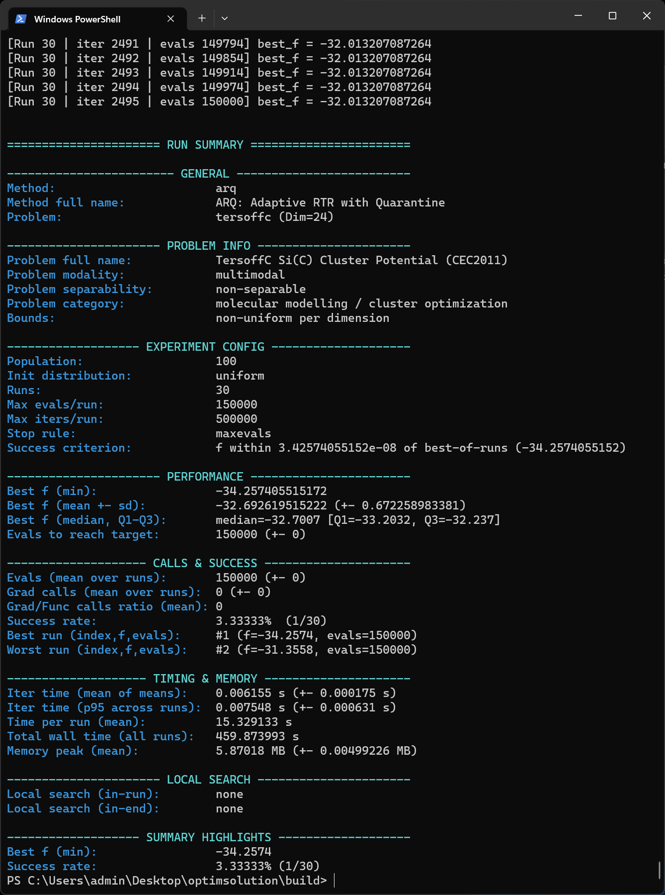

# optimSolution

Optimsolution is a C++ optimization framework for repeatable, high-throughput experimentation with population-based metaheuristics and numerical optimizers on benchmark and application-driven objective functions. It provides a uniform command-line interface to run a selected method on a selected problem under explicit computational budgets (e.g., maximum function evaluations and/or iterations), using consistent initialization and stopping rules. During execution, it logs progress and produces standardized end-of-run summaries (best/mean/dispersion, success metrics, and timing), enabling systematic empirical studies across methods, problems, and parameterizations.

## Parameter sensitivity analysis

optimsolution can be used for **parameter sensitivity analysis** per optimizer by systematically varying method parameters (e.g., population size and control parameters) and comparing performance distributions across multiple independent runs under identical stopping rules. (check the session sensitivity in optimsolution.cfg file)

---

## 1) Available methods and problems (CLI)

Use the following **short names** in the command line:

### Methods
| Short name | Full name |
|---|---|
| `aarq` | Aggressive Archive-based Quarantine Differential Evolution (AARQ) |
| `abc` | Artificial Bee Colony (ABC) |
| `aco` | Ant Colony Optimization (ACO) |
| `acor` | Ant Colony Optimization for Continuous Domains (ACOR) |
| `arq` | ARQ: Adaptive RTR with Quarantine |
| `arqdp` | ARQ Directional Prediction + Far-Horizon Lookahead + Best-First Attack (ARQDP-v10) |
| `arqeig` | ARQ with Eigen-like coordinate learning (ARQEig) |
| `arqeigrl` | Dual-zone DE with local RL (ARQEigRL) |
| `bfgs` |  | Broyden-Fletcher-Goldfarb-Shanno |
| `bho` | BioHealing Optimization (BHO) |
| `clpso` | Comprehensive Learning Particle Swarm Optimization (CLPSO) |
| `cmaes` | Covariance Matrix Adaptation Evolution Strategy (CMA-ES) |
| `de` | Differential Evolution (DE/rand/1/bin) |
| `ea4eig` | Evolutionary Algorithms with Eigen crossover (EA4eig) |
| `egco` | Eel and Grouper Optimizer(EGCO) |
| `fuse` | Fusion Search Ensemble (FUSE) |
| `ga` | Genetic Algorithm (GA) |
| `gao` | Giant Armadillo Optimizer (GAO) |
| `garq` | Golden ARQ with Reinforcement Learning (GARQ) |
| `gd` |  | Gradient Descent (local method) |
| `gde` | Golden Differential Evolution (pbest/1+archive) |
| `gderl` | Golden Differential Evolution with Reinforcement Learning (gDE-rl) |
| `gwo` | Grey Wolf Optimizer (GWO) |
| `hde` | Hybrid Differential Evolution (HDE) |
| `hjso` | HJSO: EA4eig hybrid shell with ARQ as default core |
| `jde` | Self-adaptive Differential Evolution (jDE) |
| `jso` | Hybrid Differential Evolution JSO |
| `lbfgs` | Limited-memory Broyden-Fletcher-Goldfarb-Shanno |
| `mewoa` | Modified Enhanced Whale Optimization Algorithm (MEWOA) |
| `mlshaderl` | Multi-operator L-SHADE with Reinforcement Learning (mLSHADE-RL) |
| `nm` |  Nelder–Mead Simplex |
| `pde` | Parallel Differential Evolution (PDE) |
| `pga` | Parallel Genetic Algorithm (PGA) |
| `polyde` | Polyphase Expert Multi-Strategy DE (PolyphaseDE) |
| `ppso` | Parallel Particle Swarm Optimization (PPSO) |
| `psao` | Parallel Smell Agent Optimization (PSAO) |
| `psioa` | Parallel Sporulation-Inspired Optimization Algorithm (PSIOA) |
| `pso` | Particle Swarm Optimization (PSO) |
| `rarq` | Roulette Adaptive Robust Quarantine (RARQ) |
| `sa` | Simulated Annealing (SA) |
| `sade` | Self-adaptive Differential Evolution (SaDE) |
| `sao` | Smell Agent Optimization (SAO) |
| `sioa` | Sporulation-Inspired Optimization Algorithm (SIOA) |
| `tridentde` | TRIDENT Differential Evolution (TRIDENT-DE) |
| `ude3` | Enhanced Unified Differential Evolution Algorithm 3 (UDE3) |
| `woa` | Whale Optimization Algorithm (WOA) |

### Problems
| Short name | Full name |
|---|---|
| `ackley` | Ackley benchmark function |
| `antennaarray` | 6-element circular antenna array (sidelobe level minimization) |
| `antennaula` | Uniform Linear Array (half-wavelength spacing, amplitude taper) |
| `attractivesector` | Attractive Sector benchmark function |
| `bifunctionalcatalyst` | Bifunctional catalyst dynamic optimization problem |
| `bohachevsky1` | Bohachevsky function 1 |
| `bohachevsky2` | Bohachevsky function 2 |
| `bohachevsky3` | Bohachevsky function 3 |
| `branin` | Branin (Branin-Hoo) function |
| `bucherastrigin` | Buche-Rastrigin function (BBOB-style variant) |
| `camel` | Six-Hump Camel function |
| `cassini` | Cassini interplanetary transfer timing problem |
| `cigar` | Cigar function |
| `cosinemixture` | Cosine Mixture function |
| `ded1` | Dynamic Economic Dispatch - Case 1 (quadratic cost) |
| `ded2` | Dynamic Economic Dispatch - Case 2 (9-unit system) |
| `differentpowers` | Different Powers function |
| `diracproblem` | Dirac-like Gaussian spike function |
| `easom` | Easom function |
| `eld1` | Economic Load Dispatch - 1 (single period) |
| `eld2` | Economic Load Dispatch - 2 (13-unit single-period) |
| `eld3` | Economic Load Dispatch - 3 (CEC2011 15-unit instance) |
| `eld4` | Economic Load Dispatch - 4 (40-unit CEC benchmark) |
| `eld5` | Economic Load Dispatch - 5 (CEC2011 140-unit case) |
| `ellipsoidal` | Ellipsoidal function |
| `equalmaxima` | Equal Maxima function |
| `expotential` | Expotential function  f(x)=1-exp(-0.5||x||^2) |
| `fmsynth` | FM Synth Parameter Estimation |
| `gallagher101` | Gallagher's Gaussian 101-peaks function |
| `gallagher21` | Gallagher's Gaussian 21-me Peaks |
| `gascycle` | Idealized gas cycle efficiency (Brayton-type) |
| `gkls2100` | GKLS 2D, 100 minima (D-type) |
| `gkls250` | GKLS 2D, 50 minima (D-type) |
| `gkls350` | GKLS 3D, 50 minima (D-type) |
| `goldstein` | Goldstein–Price function |
| `griewank` | Griewank function |
| `griewankrosenbrock` | Griewank–Rosenbrock Composition Function |
| `hansen` | Hansen function |
| `hartmann3` | Hartmann 3D function |
| `hartmann6` | Hartmann 6D function |
| `heatexchanger` | Heat Exchanger Design Optimization Problem |
| `himmelblau` | Himmelblau (maximize-style variant) |
| `hydrothermal` | Hydrothermal scheduling (smooth penalty model) |
| `ik6dof` | 6-DOF Inverse Kinematics (DH serial chain) |
| `katsuura` | Katsuura function |
| `levy` | Levy N.13 function |
| `lunacekbirastrigin` | Lunacek bi-Rastrigin function |
| `messenger` | MESSENGER MGA-1DSM surrogate ΔV |
| `michalewicz` | Michalewicz function |
| `ofdmpower` | OFDM Power Allocation (sum–rate with soft power constraint) |
| `polyphase` | Polyphase sequence PSL minimization (aperiodic autocorrelation) |
| `portfoliomv` | Markowitz Mean–Variance Portfolio (long-only, soft sum-to-one) |
| `potential` | Lennard-Jones Pairwise Potential |
| `rastrigin` | Rastrigin benchmark function |
| `rastrigin2` | 2D Rastrigin function (shifted, f* = -2) |
| `rosenbrock` | Rosenbrock benchmark function |
| `rotatedrosenbrock` | Rotated Rosenbrock function |
| `schaffer` | Schaffer N.2 (F6) function |
| `schwefel` | Schwefel 2.26 function |
| `shekel10` | Shekel function (m = 10, D = 4) |
| `shekel5` | Shekel function (m = 5, D = 4) |
| `shekel7` | Shekel function (m = 7, D = 4) |
| `shubert` | Shubert function (2D, highly multimodal) |
| `sinusoidal` | Multidimensional sinusoidal test function |
| `sphere` | Sphere benchmark function |
| `stepellipsoidal` | Step-Ellipsoidal function |
| `tandem` | Tandem MGA-1DSM surrogate ΔV |
| `tersoffb` | TersoffB Si(B) Cluster Potential (CEC2011) |
| `tersoffc` | TersoffC Si(C) Cluster Potential (CEC2011) |
| `test2n` | Separable quartic polynomial (Test2n) |
| `test30n` | Oscillatory non-separable benchmark (Test30n) |
| `tnep` | Transmission Network Expansion Planning (DC-OPF surrogate) |
| `transmissionpricing` | Transmission pricing via PTDF-based DC power flow |
| `vibratingplatform` | Base-excited SDOF isolation platform design |
| `weierstrass` | Weierstrass function |
| `wirelesscoverage` | Wireless coverage planning (antenna placement & power) |
| `zakharov` | Zakharov function |

---

---

---

## 2) Windows (Debug)

### Prerequisites
- Visual Studio 2022 (Community or Build Tools)
  - Workload: Desktop development with C++
  - Components: MSVC v143, Windows 10/11 SDK, CMake Tools (optional but recommended)
- CMake (if not installed via Visual Studio): ensure it is available in your system PATH
- (Optional) Ninja for faster builds

### Configure / Build / Run (Debug)
```bat
1] cd /path/to/optimsolution
2] cmake -S . -B build -G "Visual Studio 17 2022" -A x64
3] cmake --build build --config Debug
4] cd build
5] .\Debug\optimsolution jso rastrigin 30
```

---

## 2) Linux (Debug)

### Install
```bash
sudo apt update
sudo apt install -y build-essential cmake gdb
sudo apt install -y ninja-build
```

### Configure / Build / Run (Debug)
```bash
1] cd /path/to/optimsolution
2] cmake -S . -B build -DCMAKE_BUILD_TYPE=Debug
3] cmake --build build -j
4] cd build
5] ./optimsolution jso rastrigin 30
```

---

## 4) Settings used (optimsolution.cfg)

The executable reads experiment defaults from `optimsolution.cfg`.  
The **[global]** section defines defaults, while a **method section** (e.g., **[arq]**) can **override** keys such as `population`, `local_rate`, etc.

### Key defaults
```ini
[global]
population = 200
max_iters  = 500000
max_evals  = 150000
seed_base  = 4242
runs       = 30
success_tol = 1e-8
local_rate   = 0.00
local_method = lbfgs
end_local_refine = 0
end_local_method = lbfgs   ; or bfgs / nm / gd
summary_enable           = 1

[stop]
rule    = maxevals         ; bss|wss|tss|boss|srs|irs|doublebox|maxevals|all|none
eps     = 1e-10

[init]
type = uniform             ; uniform | normal | cauchy | laplace | lognormal | exponential | beta | levy | lhs | halton | oppositional
```

### ARQ method overrides (used in the attached run)
```ini
[arq]
population 	 = 100
pbest_frac   = 0.12
F            = 0.1
CR           = 0.9
archive_rate = 1.5
batch_frac   = 0.5
local_rate   = 0.00
local_method = lbfgs
```

### How these settings map to the run summary
- **Population**
  - Default: `global.population = 200`
  - **ARQ override:** `arq.population = 100` → shown as `Population: 100`
- **Runs**
  - `global.runs = 30` → shown as `Runs: 30`
- **Stopping rule / evaluation budget**
  - `stop.rule = maxevals`
  - `global.max_evals = 150000` → shown as `Max evals/run: 150000` and the run stops at `evals 150000`
- **Maximum iterations**
  - `global.max_iters = 500000` → shown as `Max iters/run: 500000`
- **Initialization**
  - `init.type = uniform` → shown as `Init distribution: uniform`
- **Local search**
  - `local_rate = 0.00` (global and ARQ) → shown as `Local search: none`

---

## 5) Example run output (end of execution)

The following screenshot shows the **last iterations of Run 30** and the **final run summary** for:
- **Method:** `arq`
- **Problem:** `tersoffc (Dim=24)`
- **Runs:** 30
- **Budget:** 150000 evals/run



### What the last iteration lines mean
Lines like:
- `iter 2495 | evals 150000 | best_f = -32.013207...`

indicate:
- **iter**: iteration counter,
- **evals**: total function evaluations used so far,
- **best_f**: best objective value found so far in that run.

The flat `best_f` in the last lines indicates no improvement near the end, and the run stops because it reaches the configured evaluation budget (`maxevals` / `max_evals`).

### How to read the RUN SUMMARY (quick)
- **Best f (min)**: best result over all runs.
- **Best f (mean ± sd)**: average performance (and variability) over runs.
- **Median, Q1–Q3**: robust distribution summary.
- **Success rate**: how many runs satisfy the success criterion (here `1/30`).
- **Timing & memory**: runtime statistics and memory footprint.
