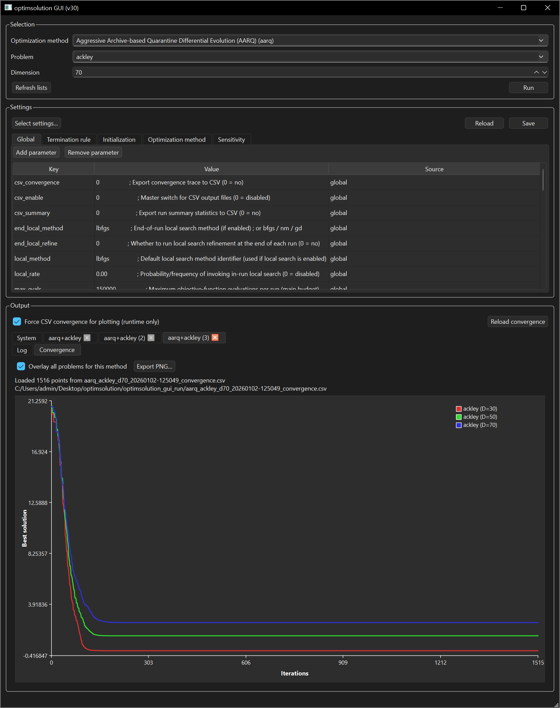

<p align="center">
  
</p>

Optimsolution is a C++ optimization framework for repeatable, high-throughput experimentation with population-based metaheuristics and numerical optimizers on both benchmark and application-driven objective functions. It provides a consistent CLI and a Qt-based GUI, supports explicit computational budgets (for example maximum function evaluations and/or iterations), and produces standardized end-of-run summaries for systematic comparisons across methods, problems, and parameter settings.

The current build described in this README is aligned with the active `CMakeLists.txt` and currently exposes **62 methods** and **90 problems** in the CLI.

> English manual: [optimsolution_manual_EN.pdf](./docs/optimsolutionManual_EN.pdf)
>
> Greek manual: [optimsolution_manual_GR.pdf](./docs/optimsolutionManual_GR.pdf)

---

## 1) What changed from GUI v47 to v48

Version 48 extends and cleans up the batch-analysis workflow introduced in earlier GUI versions.

### Batch analysis is now more complete
The **System** tab now provides a richer batch-analysis workspace. In addition to the main results table, the GUI includes separate views for:

- **Results Table**
- **Best Table**
- **Mean Table**
- **Best Ranking**
- **Mean Ranking**
- **Final Ranking**
- **Pairwise Wilcoxon**
- **Friedman Ranking**

This makes it easier to inspect raw batch values, per-problem rankings, and overall final rankings without leaving the GUI.

### External experiment loading is more robust
`Load experiment CSV...` now supports two practical workflows:

1. loading a single convergence CSV as an output tab, and
2. reconstructing a full batch from a folder that contains batch experiment CSV files.

When a batch is reconstructed, the GUI now restores the detected methods, problems, dimensions, and the relevant batch-analysis state more reliably.

### Better synchronization for batch selections and dimensions
The Selection area and the batch summary views are now better synchronized. When batch methods, problems, or variable dimensions change, the corresponding batch table content is refreshed more consistently, and stale cached cells are invalidated when dimensions no longer match.

### Improved convergence plotting
The convergence plot logic in v48 improves two practical issues:

- the Y-axis can anchor to a known best minimum when that information is available, which helps with problems whose optimum is negative or otherwise far from the currently displayed range,
- the extra compact black info panel is no longer drawn on top of overlay convergence plots; the standard legend remains the primary plot annotation.

### Safer CSV cleanup
`Delete CSV files` is now restricted to the GUI runtime folder tree named **`optimsolution_gui_run`**. This makes the cleanup action more predictable and avoids scanning unrelated directories.

---

## 2) Available methods and problems (CLI)

CLI syntax:

```bash
optimsolution <method> <problem>
```
or

```bash
optimsolution <method> <problem> <dimension>
```
The identifiers below are the **exact short names** currently built from the active `CMakeLists.txt`. If an older README, screenshot, or note mentions a short name that is not listed here, it should be treated as outdated for the current build.

### Methods (62)

#### Differential evolution and closely related variants

`arq`, `arq2`, `awjso`, `bjso`, `bwjso`, `de`, `ea4eig`, `jde`, `jso`, `mjso`, `mlshaderl`
`nlshadelbc`, `pde`, `sade`, `sfcde`, `tridentde`, `ude`, `ude3`, `ujso`

#### Population-based, swarm, evolutionary, and hybrid optimizers

`abc`, `acor`, `alo`, `ba`, `bho`, `clpso`, `cmaes`, `cs`, `egco`, `eo`, `fa`, `ga`, `gahs`
`gao`, `gsa`, `gwo`, `hba`, `hho`, `hs`, `jaya`, `kh`, `mewoa`, `mfo`, `mpa`, `mvo`, `pga`
`ppso`, `psao`, `psioa`, `pso`, `sa`, `sao`, `sca`, `sioa`, `sma`, `so`, `tlbo`, `wca`, `woa`

#### Local search methods

`bfgs`, `gd`, `lbfgs`, `nm`

### Problems (90)

#### Classical and synthetic benchmarks

`ackley`, `attractivesector`, `bohachevsky1`, `bohachevsky2`, `bohachevsky3`, `branin`
`bucherastrigin`, `camel`, `cigar`, `cosinemixture`, `differentpowers`, `diracproblem`, `easom`
`ellipsoidal`, `equalmaxima`, `expotential`, `gallagher101`, `gallagher21`, `goldstein`
`griewank`, `griewankrosenbrock`, `hansen`, `hartmann3`, `hartmann6`, `katsuura`, `levy`
`lunacekbirastrigin`, `michalewicz`, `potential`, `rastrigin`, `rastrigin2`, `rosenbrock`
`rotatedrosenbrock`, `schaffer`, `schwefel`, `shekel5`, `shekel7`, `shekel10`, `shubert`
`sinusoidal`, `sphere`, `stepellipsoidal`, `test2n`, `test30n`, `weierstrass`, `zakharov`

#### Real-world and application-driven problems

`antennaarray`, `antennaula`, `bifunctionalcatalyst`, `cassini`, `ded1`, `ded2`, `eld1`, `eld2`
`eld3`, `eld4`, `eld5`, `fmsynth`, `gascycle`, `heatexchanger`, `himmelblau`, `hydrothermal`
`ik6dof`, `messenger`, `ofdmpower`, `polyphase`, `portfoliomv`, `tandem`, `tersoffb`, `tersoffc`
`tnep`, `transmissionpricing`, `vibratingplatform`, `wirelesscoverage`

#### GKLS test classes

`gkls`, `gkls250`, `gkls350`, `gkls2100`

#### CEC 2022 representative functions

`cec2022_zakharov`, `cec2022_rosenbrock`, `cec2022_schafferf7`
`cec2022_noncontinuous_rastrigin`, `cec2022_levy`, `cec2022_hybrid2`, `cec2022_hybrid6`
`cec2022_hybrid10`, `cec2022_composition1`, `cec2022_composition2`, `cec2022_composition6`
`cec2022_composition7`


---

## 3) Windows (Console + GUI)

> **Windows installer available:** Download and run **Optimsolution.exe** from:
>
> **[Optimsolution.exe (Windows Installer)](https://www.dit.uoi.gr/files/optimsolution.zip)**

### Prerequisites
- Visual Studio 2022 (Community or Build Tools)
  - Workload: **Desktop development with C++**
  - Components: **MSVC v143**, **Windows 10/11 SDK**
- CMake available in **PATH**
- **Qt 6.x (MSVC 2022 x64)** for the GUI target, for example `C:\Qt\6.10.1\msvc2022_64`

Recommended shell: **x64 Native Tools Command Prompt for VS 2022** or **Developer PowerShell for VS 2022**.

### Build and run (GUI + CLI) — Debug

Delete the existing `build` directory.

```powershell
Remove-Item -Recurse -Force .\build -ErrorAction SilentlyContinue
```

Configure the project with the GUI target enabled.

```powershell
cmake -S . -B build -G "Visual Studio 17 2022" -A x64 `
  "-DCMAKE_PROJECT_INCLUDE:FILEPATH=$PWD/cmake/optimsolution_gui.cmake" `
  "-DCMAKE_PREFIX_PATH=C:\Qt\6.10.1\msvc2022_64"
```

Build the GUI executable.

```powershell
cmake --build build --config Debug --target optimsolution_gui
```

Build the CLI executable.

```powershell
cmake --build build --config Debug --target optimsolution
```

Deploy the required Qt runtime next to the GUI executable.

```powershell
& "C:\Qt\6.10.1\msvc2022_64\bin\windeployqt.exe" `
  --no-translations --compiler-runtime `
  ".\build\Debug\optimsolution_gui.exe"
```

Run the GUI.

```powershell
.\build\Debug\optimsolution_gui.exe
```

Run the CLI (example).

```powershell
.\build\Debug\optimsolution.exe arq tersoffc
```

---

## 4) Linux (Console + GUI)

### Prerequisites
- GCC or Clang
- CMake
- Ninja (recommended)
- **Qt 6.x development packages** for the GUI target

Recommended shell: a standard terminal in the repository root.

### Build and run (GUI + CLI) — Debug

```bash
sudo apt update
sudo apt upgrade
sudo apt install qt6-base-dev qt6-base-dev-tools qt6-tools-dev qt6-tools-dev-tools
rm -rf build
cmake -S . -B build -G Ninja -DCMAKE_BUILD_TYPE=Debug -DCMAKE_PROJECT_INCLUDE=cmake/optimsolution_gui.cmake
cmake --build build --target optimsolution_gui
cmake --build build --target optimsolution
./build/optimsolution_gui
./build/optimsolution arq tersoffc
```

---

## 5) Settings (`optimsolution.cfg`)

### Console (CLI)

The console solver reads experiment defaults from `optimsolution.cfg`.

- **`[global]`** defines run-wide defaults such as population, evaluation budget, number of runs, and seeding.
- A **method section** such as `[jso]`, `[arq]`, or `[ga]` can override global keys for a specific optimizer.
- Additional sections such as **`[init]`**, **`[stop]`**, and **`[sensitivity]`** control initialization, stopping rules, and parameter sensitivity studies.

### Key defaults

```ini
[global]
population = 200
max_iters  = 500000
max_evals  = 150000
seed_base  = 4242
runs       = 30
success_tol = 1e-8
local_rate   = 0.00
local_method = lbfgs
end_local_refine = 0
end_local_method = lbfgs   ; or bfgs / nm / gd
summary_enable = 1

[stop]
rule = maxevals            ; bss|wss|tss|boss|srs|irs|doublebox|maxevals|all|none
eps  = 1e-10

[init]
type = uniform             ; uniform | normal | cauchy | laplace | lognormal | exponential | beta | levy | lhs | halton | oppositional
```

### Example method overrides

```ini
[arq]
population   = 100
pbest_frac   = 0.12
F            = 0.1
CR           = 0.9
archive_rate = 1.5
batch_frac   = 0.5
local_rate   = 0.00
local_method = lbfgs
```

### How these settings map to the run summary
- **Population**: `global.population = 200`, but a method section can override it.
- **Runs**: `global.runs = 30`.
- **Evaluation budget**: `stop.rule = maxevals` together with `global.max_evals`.
- **Maximum iterations**: `global.max_iters = 500000`.
- **Initialization**: `init.type = uniform`.
- **Local search**: controlled by `local_rate`, `local_method`, and `end_local_refine`.

The GUI uses the same configuration file as the CLI, but it can apply runtime-only overrides when launching runs. A practical example is the **Force CSV convergence for plotting** option, which helps the GUI populate convergence plots and batch-analysis tables from CSV traces.

---

## 6) GUI notes

The GUI and CLI share the same optimization core. In practice, the GUI is useful when you want to:

- inspect convergence plots,
- load a previous experiment CSV,
- reconstruct a batch from saved CSV files,
- export tables and plots,
- run sensitivity studies from the same configuration base.

Current GUI overview:



For details, see the English manual: [optimsolution_manual_EN.pdf](./docs/optimsolutionManual_EN.pdf)

---

## 7) Example run console output (end of execution)

The following screenshot shows the last iterations of **Run 30** and the final summary for:

- **Method:** `arq`
- **Problem:** `tersoffc (Dim=24)`
- **Runs:** 30
- **Budget:** 150000 evals/run


